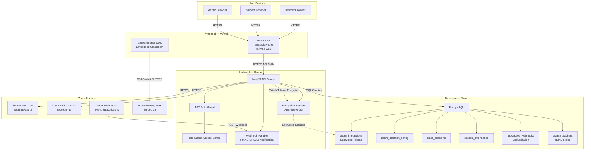
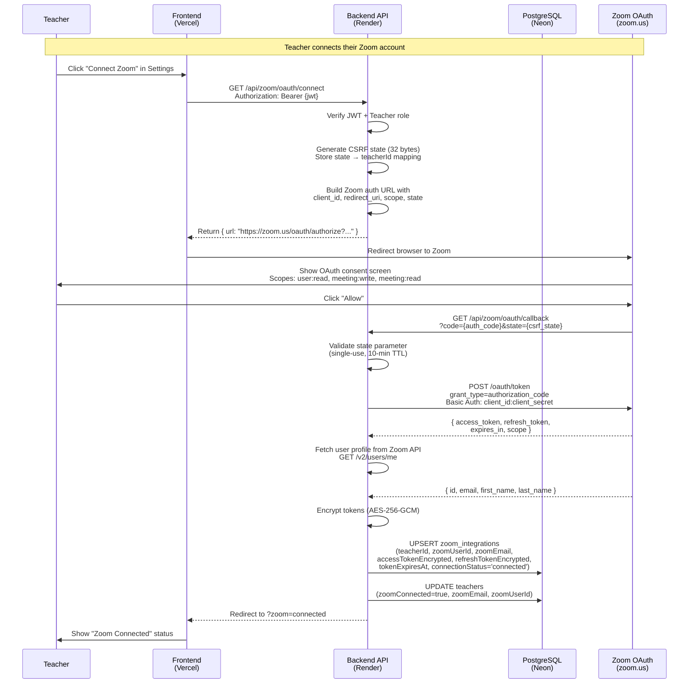
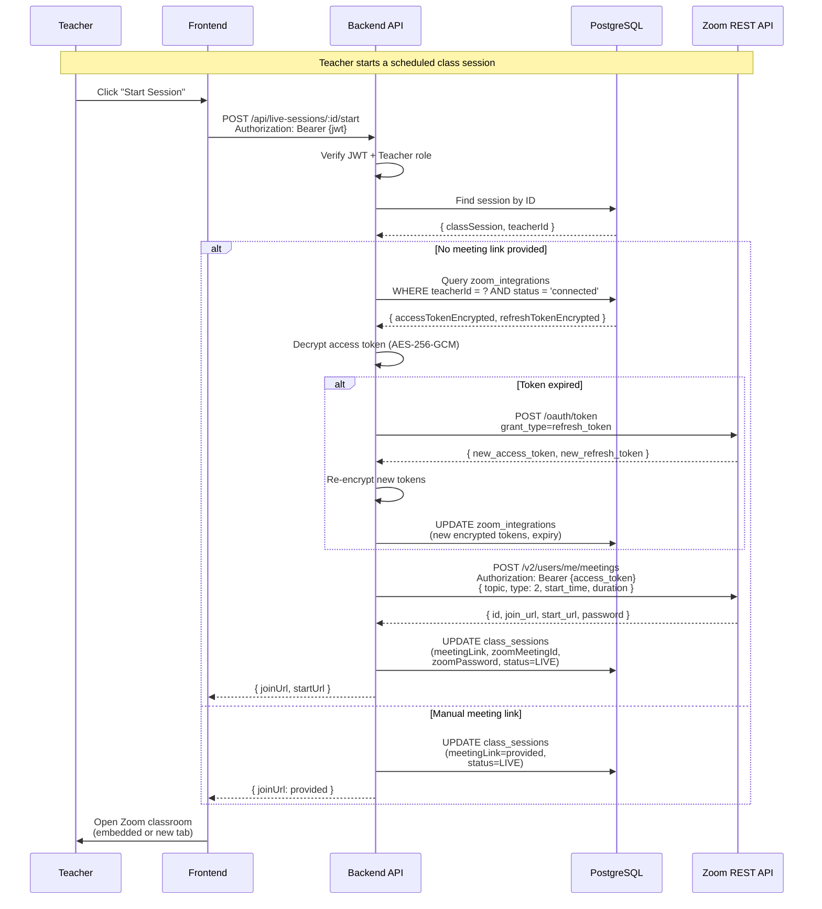
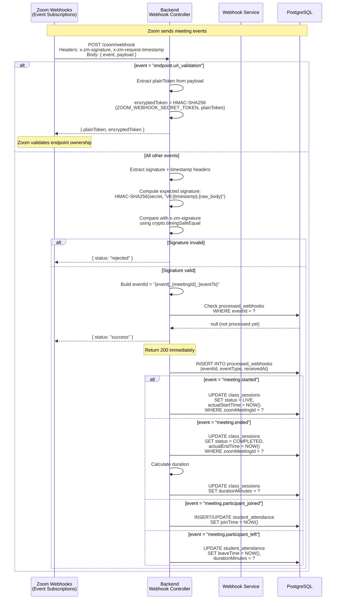
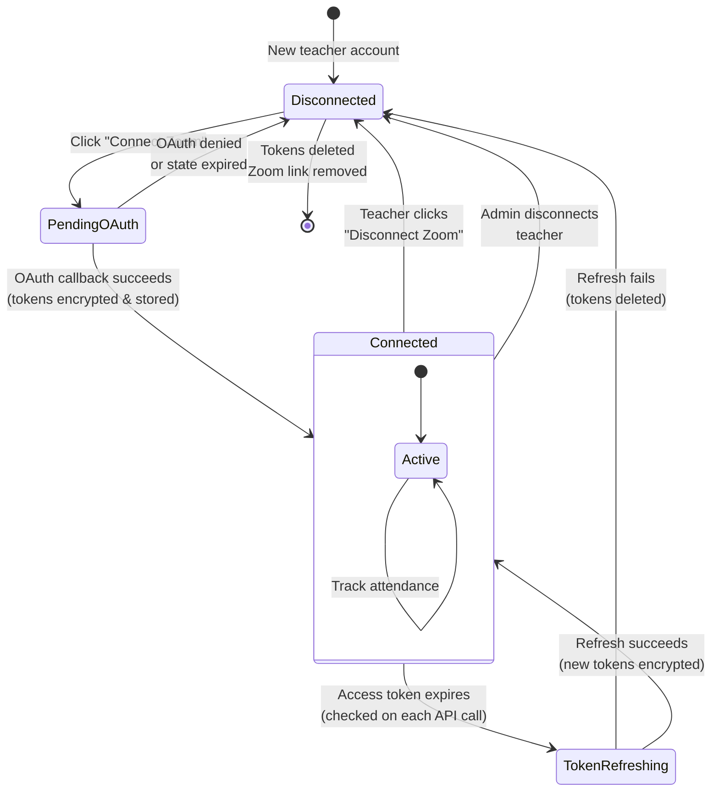
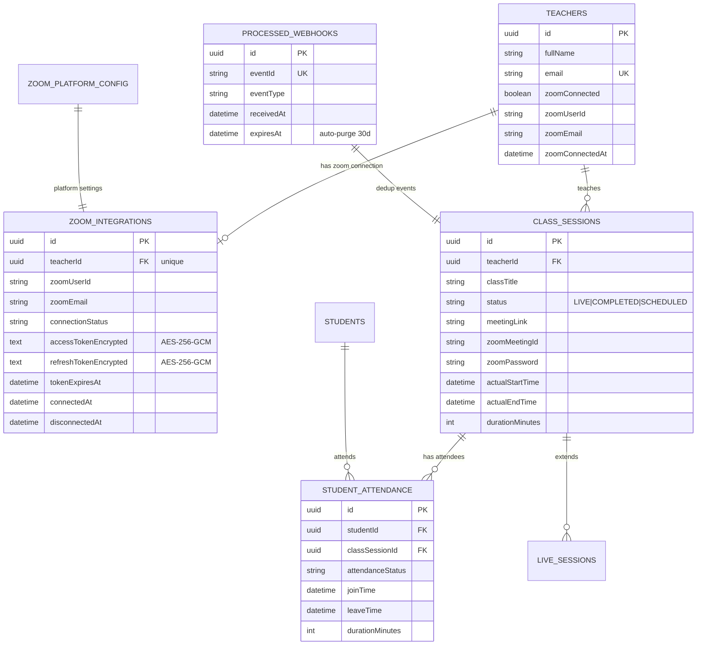
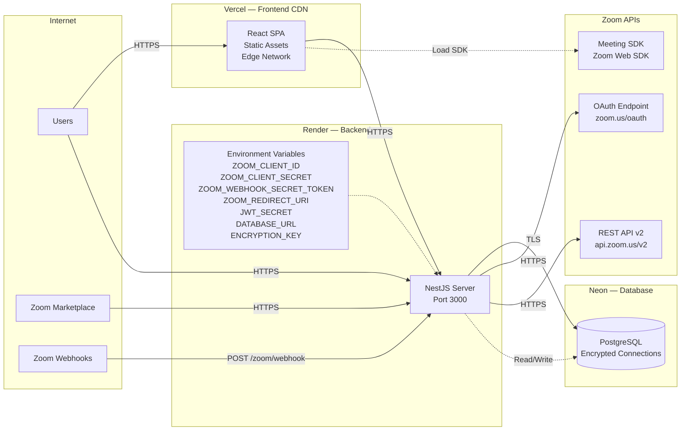

# Architecture & Flow Diagrams

**Application:** Nejah Online Quran Center
**Version:** 1.0
**Date:** July 12, 2026

---

## 1. System Architecture Overview



---

## 2. OAuth Authorization Code Flow



---

## 3. Live Class Meeting Creation Flow



---

## 4. Webhook Event Processing Flow



---

## 5. Teacher Data Flow — Token Lifecycle



---

## 6. Database Entity Relationships



---

## 7. Infrastructure Topology



---

## 8. Prompt for Flowchart Tool

Copy and paste this prompt into any AI flowchart tool (Mermaid Live, draw.io AI, Lucidchart AI, Eraser.io, etc.):

```
Generate an architectural diagram for a Zoom-integrated Quran education platform with these components:

LAYERS (top to bottom):

1. CLIENT LAYER:
   - Teacher Browser (React SPA on Vercel)
   - Student Browser (React SPA on Vercel)
   - Admin Browser (React SPA on Vercel)

2. CDN LAYER:
   - Vercel Edge Network (static assets, HTTPS)

3. API LAYER:
   - NestJS Backend Server (Render, port 3000)
   - JWT Authentication Guard
   - Role-Based Access Control (SUPER_ADMIN, ADMIN, TEACHER, STUDENT, PARENT)
   - Encryption Service (AES-256-GCM)
   - Webhook Handler (HMAC-SHA256 signature verification)

4. DATABASE LAYER:
   - PostgreSQL on Neon (encrypted connections)
   - Tables: zoom_integrations (encrypted tokens), class_sessions, student_attendance, processed_webhooks, users, teachers

5. ZOOM PLATFORM:
   - Zoom OAuth API (zoom.us/oauth) — Authorization Code Flow
   - Zoom REST API v2 (api.zoom.us) — Meetings, Users, Reports, ZAK tokens
   - Zoom Webhooks (Event Subscriptions) — meeting.started, meeting.ended, participant_joined, participant_left
   - Zoom Meeting SDK (Embed JS) — In-app classroom

CONNECTIONS:
- Users → HTTPS → Vercel CDN → HTTPS → NestJS API
- NestJS API → TLS → PostgreSQL
- NestJS API → HTTPS → Zoom OAuth (token exchange)
- NestJS API → HTTPS → Zoom REST API (meeting management)
- Zoom Webhooks → POST → NestJS /zoom/webhook (signature verified)
- Vercel → Load → Zoom Meeting SDK JS

SECURITY ANNOTATIONS:
- All traffic: TLS 1.2+
- OAuth tokens: AES-256-GCM encrypted at rest
- Webhooks: HMAC-SHA256 signature + timing-safe comparison
- Authentication: JWT with bcrypt passwords
- CSRF: OAuth state parameter (32-byte, single-use, 10-min TTL)
```
